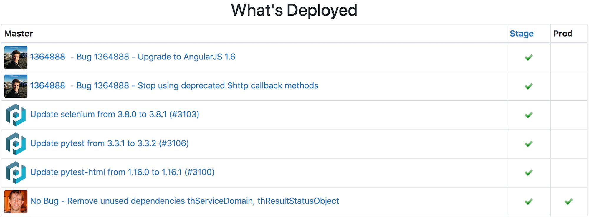
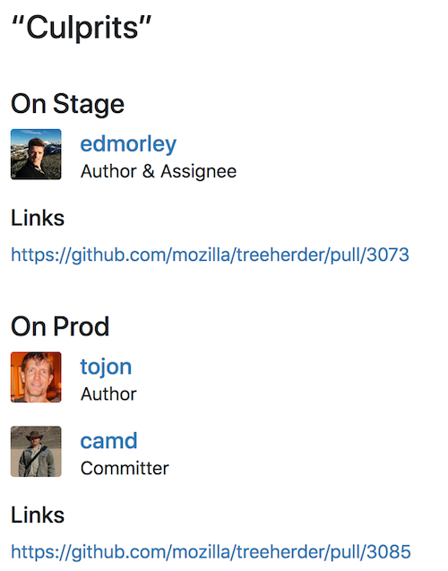

# What's Deployed?

What's deployed from a GitHub repo on various server environments?

This requires that you have 2 or more URLs that return a git sha that
references which git sha has been deployed.

## Screenshots

### Main table



### "Culprits"



## License

[MPL 2.0](http://www.mozilla.org/MPL/2.0/)

## Credits

[Checkbox icon](https://www.iconfinder.com/icons/282474/check_done_ok_icon#size=16)
by [IcoCentre](https://www.iconfinder.com/konekierto).

## Development

Development requires both Python 3.6 or higher for the backed, and JS for the
front end.

To install dependencies:

```
pip install -r requirements.txt
pip install -r dev-requirements.txt
yarn install
```

To run the app, first start the backend (note, you need at least Python 3.6):

```
DEBUG=1 SQLALCHEMY_DATABASE_URI='postgres:///whatsdeployed' ./app.py
```

and then in a separate terminal, start the frontend:

```
yarn start
```

This will automatically open your browser to http://localhost:3000/

To avoid hitting rate limits on GitHub's API you can go to
[Personal access tokens](https://github.com/settings/tokens) and generate
a token (without any scopes). How can you set:

```
export GITHUB_AUTH_TOKEN=afefdf213840aeb8007310ab05fc33eda51a0652
```

**Environment variables**

You can put all your environment variables into a `.env` file, like this:

```
GITHUB_AUTH_TOKEN=afefdf213840aeb8007310ab05fc33eda51a0652
DEBUG=1
SQLALCHEMY_DATABASE_URI='postgres:///whatsdeployed'
```

This file will automatically be read when running the Python backend.

## Deployment

**Really basic for now**.

For the front-end, we check the output of `yarn run build`
as a `build.zip` file. This is generated by running `./bin/build.sh`.

## Upgrade dependencies

To upgrade a dependency, edit `requirements.in` and then run:

```
pip-compile --generate-hashes requirements.in
```

Now you should have a change in `requirements.in` _and_ in `requirements.txt`.
Check in both.
